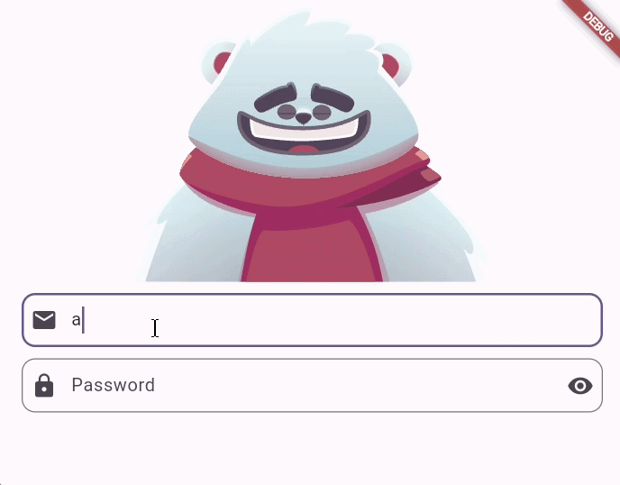

# login_with_rive_animation_5sa_26_1
# 🐻 Flutter Rive Animated Login

An interactive and engaging login screen built with **Flutter** and **Rive**. This project demonstrates how to integrate complex state-machine animations that react in real-time to user input.

---

Markdown
# 🐻 Flutter Rive Animated Login

An interactive and engaging login screen built with **Flutter** and **Rive**. This project demonstrates how to integrate complex state-machine animations that react in real-time to user input.

---

## 📖 Project Overview

This application features a custom animated character (a bear) that reacts dynamically as the user interacts with the login form. 

### ✨ Key Functionalities
* **Dynamic Focus Tracking:** The character follows the cursor while the user types their email.
* **Privacy Animation:** The character covers its eyes when the password field is focused.
* **Input Validation States:** Built-in triggers for "Success" and "Fail" animations.
* **Secure Toggle:** Option to show/hide password with a synchronized UI icon.

---

## 🛠️ Technical Concepts

### What is Rive?
**Rive** is a powerful real-time interactive design and animation tool. Unlike traditional video or GIF formats, Rive animations are functional code, allowing developers to manipulate individual layers and states dynamically within an app.

### What is a State Machine?
A **State Machine** in Rive is a visual way to connect animations together. It defines the logic that governs how animations transition from one state to another based on inputs (Booleans, Numbers, or Triggers). In this project, the State Machine listens to Flutter inputs like `isChecking` or `isHandsUp` to change the character's behavior.

---

## 🚀 Tech Stack

* 💙 **Flutter** - UI Framework.
* 📦 **Rive Package** - For real-time vector animations.
* 🎯 **Dart** - Programming language.

---

## 📂 Project Structure

The main logic is located within the `lib/` directory:

```text
lib/
├── main.dart           # Application entry point
└── login_screen.dart   # Main UI and Rive logic (State Machine Controller)
assets/
└── animated_login_bear.riv  # Rive animation asset
```

🎥 Demo



👤 Academic Information

Course: Computer systems engineering

Professor: Rodrigo Fidel Gaxiola Sosa

Student: Leandro Emilio Tzuc Rodriguez

🎨 Credits

Special thanks to the creator of the original animation:

Animation by: Pratiksha Rajpurohit

Link: https://rive.app/marketplace/3645-7621-remix-of-login-machine/

📄 License
This project is for educational purposes.